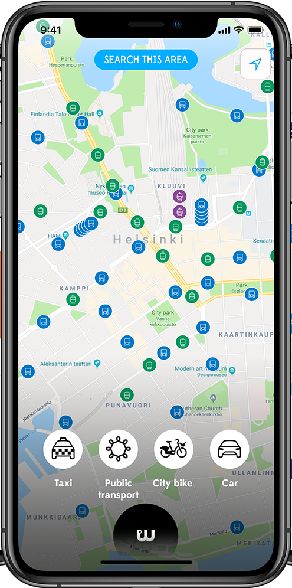

<!-- Space: SA -->
<!-- Title: Test -->
<!-- Layout: plain -->
<!-- Attachment: 191001_Homepage_hero_image_FI_EN.png -->

# Temp

## Test

### Page

#### Here

d
dasasd

Test table

Name    | Age
--------|------
Bob     | 27
Alice   | 23


<!-- Macro: WS-\d+
     Template: ac:jira:ticket
     Ticket: ${0} -->

See task WS-5945.

<!-- Macro: :done:
     Template: ac:status
     Title: DONE
     Color: Green -->

<!-- Macro: :todo:
     Template: ac:status
     Title: TODO
     Color: Blue -->

* :done: Write Article
* :todo: Publish Article

```javascript
func getTrue() bool {
    return true
}
```

### This is a definition list

Cat
: Fluffy animal **everyone** likes

Internet
: Vector of transmission for pictures of cats

### This attachment list




### Task list

- [x] Finish my changes
- [ ] Push my commits to GitHub
- [ ] Open a pull request


### User reference

Here is user @Ruslan @{Ruslan}
